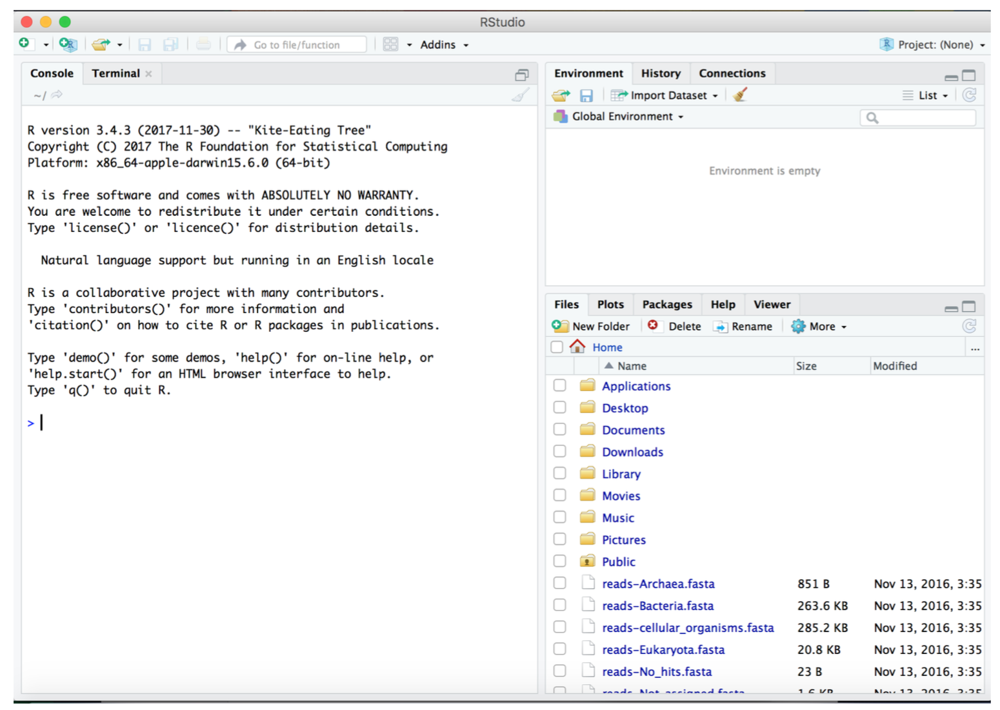
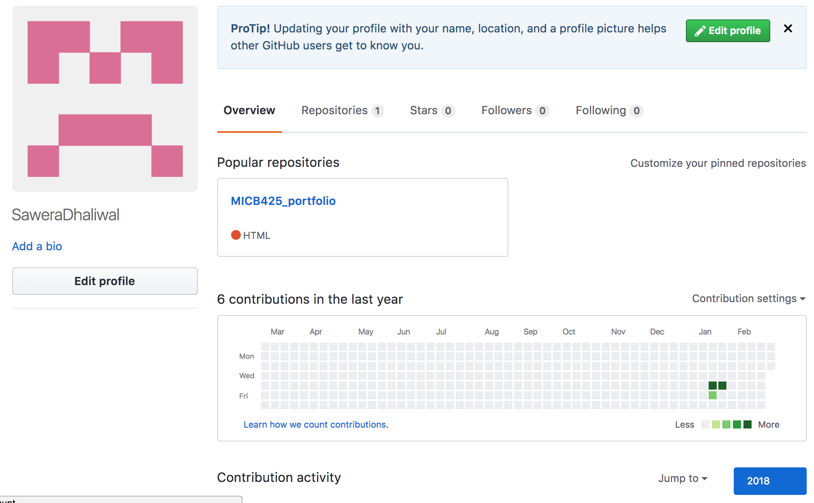

# Module 01
## Data Science Friday  
### Installation check
{width=50%}
{width=50%}
{width=50%}

### RMarkdown pretty html challenge
```{r child = "prettyhtml.Rmd"}
```

## Origins and Earth Systems
```{r child = "Worksheet 1.Rmd"}
```

```{r child = "Worksheet 2.Rmd"}
```

```{r child = "Worksheet 3.Rmd"}
```

```{r child = "Problem Set 1.Rmd"}
```

```{r child = "Problem Set 2.Rmd"}
```

### Module 01 References
Falkowski PG, Fenchel T, Delong EF. 2008. The Microbial Engines That Drive Earth's Biogeochemical Cycles. Science. 320(5879):1034-1039. [Science1153213](http://science.sciencemag.org/content/320/5879/1034.full)

Kasting JF, and Siefert JL. 2002. Life and the Evolution of Earth's Atmosphere. Science. 296(5570):1066-1068. [Science1071184](http://science.sciencemag.org/content/296/5570/1066.full)

Rockstrom et al. 2009. A safe operating space for humanity. Nature. 461:472-475. [Nature461472](https://www.nature.com/articles/461472a)

Whitman WB, Coleman DC, and Wiebe WJ. 1998. Prokaryotes: The unseen majority. Proc Natl Acad Sci USA. 95(12):6578–6583.  [PMC33863](https://www.ncbi.nlm.nih.gov/pmc/articles/PMC33863/)

