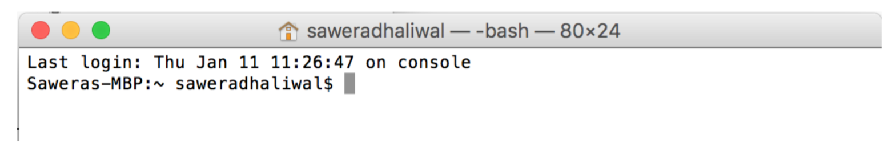

# Module 01
## Module 01 portfolio check
* Installation check
    + Completion status:
    + Comments:
* Portfolio repo setup
    + Completion status: 
    + Comments:
* RMarkdown Pretty html Challenge
    + Completion status:
    + Comments:
* Evidence worksheet_01
    + Completion status:
    + Comments:
* Evidence worksheet_02
    + Completion status:
    + Comments:
* Evidence worksheet_03
    + Completion status:
    + Comments:
* Problem Set_01
    + Completion status:
    + Comments:
* Problem Set_02
    + Completion status:
    + Comments:
* Writing assessment_01
    + Completion status:
    + Comments:
* Additional Readings
    + Completion status:
    + Comments  
    
## Data science Friday  
### Installation check
{width=50%}
{width=50%}
{width=50%}

### Portfolio repo setup (!!!)
Detail the code you used to create, initialize, and push your portfolio repo to GitHub. This will be helpful as you will need to repeat many of these steps to update your porfolio throughout the course.

### RMarkdown pretty html challenge

## Origins and Earth Systems
### Evidence Worksheet 01 
### Evidence Worksheet 02
### .......... 
### Problem set 01

### Module 01 references (!!!)
Whitman WB, Coleman DC, and Wiebe WJ. 1998. Prokaryotes: The unseen majority. Proc Natl Acad Sci USA. 95(12):6578–6583.  [PMC33863](https://www.ncbi.nlm.nih.gov/pmc/articles/PMC33863/)