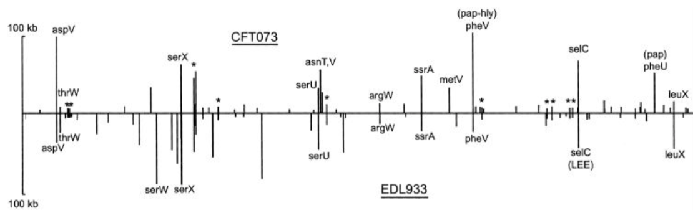

### Evidence Worksheet 05
[Welch *et al* 2002](https://www.ncbi.nlm.nih.gov/pubmed/12471157)

#### Part 1: Learning objectives
Evaluate the concept of microbial species based on environmental surveys and cultivation studies. 

Explain the relationship between microdiversity, genomic diversity, and metabolic potential.

Comment on the forces mediating divergence and cohesion in natural microbial communities. 

#### Part 1: Prompt
* What were the main questions being asked?  
Define difference between uropathogenic and enterohemorragic strains of E. coli by comparing genome sequences. Specifically compare CFT073 to EDL933 and MG1655. 

* What were the primary methodological approaches used?  
Random clones were sequenced using a dye. Use PCR based techniques to analyze data. Data was collected using automated sequencers and sequences assembled with SEQMANII. Genome was annotated with MAGPIE (uses GLIMER to find ORFs) and proteins annotated with BLAST search. 

* Summarize the main results or findings.  
The common core E. coli chromosome is preserved through vertical transfer. Island locations often at same position in backbone in CFT073 and EDL933 strains. This results in ability to infect the urinary tract and bloodstream. Differences in enterohemorhaggic and uropathogenic E. coli are reflected in CFT073 lack of type III secretion system and certain phage/plasmid virulence genes. In conclusion, it's not enough to define species by some phenotypic traits and low resolution mapping; there's much more to be studied and considered 

* Do new questions arise from the results?  
The authors of the article didn't explicitly mention questions arising from the results. However, they do point out the vast quantity of unique DNA in E. coli strains, perhaps suggesting these need to be defined further. In addition, the authors do present a number of propositions throughout the article that should be confirmed. 

* Were there any specific challenges or advantages in understanding the paper (e.g. did the authors provide sufficient background information to understand experimental logic, were methods explained adequately, were any specific assumptions made, were conclusions justified based on the evidence, were the figures or tables useful and easy to understand)?  
The paper was well formatted with a clear abstract, materials and methods, results, discussion portions. Background information provided was succinct and relevant to the rest of the paper. It did a good job at explaining why their research was relevant and worthy. Although the background information section did not justify the methods or provide information that would support the results they drew from their data. The authors made some assumptions, but pointed them out (ex. criteria for inferring orthology of CFT073 genome). Like the rest of the paper, the number of table and images provided was sufficient, and effective in supporting major points of the paper. 

#### Part 2: Learning objectives 
Comment on the creative tension between gene loss, duplication and acquisition as it relates to microbial genome evolution

Identify common molecular signatures used to infer genomic identity and cohesion

Differentiate between mobile elements and different modes of gene transfer

#### Part 2: Prompt
Based on your reading and discussion notes, explain the meaning and content of the following figure derived from the comparative genomic analysis of three E. coli genomes by Welch et al. Remember that CFT073 is a uropathogenic strain and that EDL933 is an enterohemorrhagic strain. Explain how this study relates to your understanding of ecotype diversity. Provide a definition of ecotype in the context of the human body. Explain why certain subsets of genes in CFT073 provide adaptive traits under your ecological model and speculate on their mode of vertical descent or gene transfer.  

  The figure is describing gene islands, which are used as evidence of horizontal gene transfer. From the image, we can see there are many shared locations of gene islands, whose size can vary up to 80bp. We would anticipate that islands of the same size and location are nearly identical, and it is the varying islands that define differences between uropathogenic and enterohemorrhagic strains. 

  Ecotype diversity describes a distinct form or race of an organism in a particular habitat. For example, within the body ecotype diversity can be manifested as the distinct microbes that occupy characteristic parts of our bodies. Therefore, ecotype diversity can be caused by differences in gene islands occurring as a result of HGT. Based on this, the CFT073 adaptive traits a result of the presence of asnT,V, metV or (pap)pheU, the absence of serW, or the difference between the sizes of many of the islands, (pap-hly)pheV and pheV, or selC and selC(LEE). These adaptive traits are likely acquired by HTG. 
